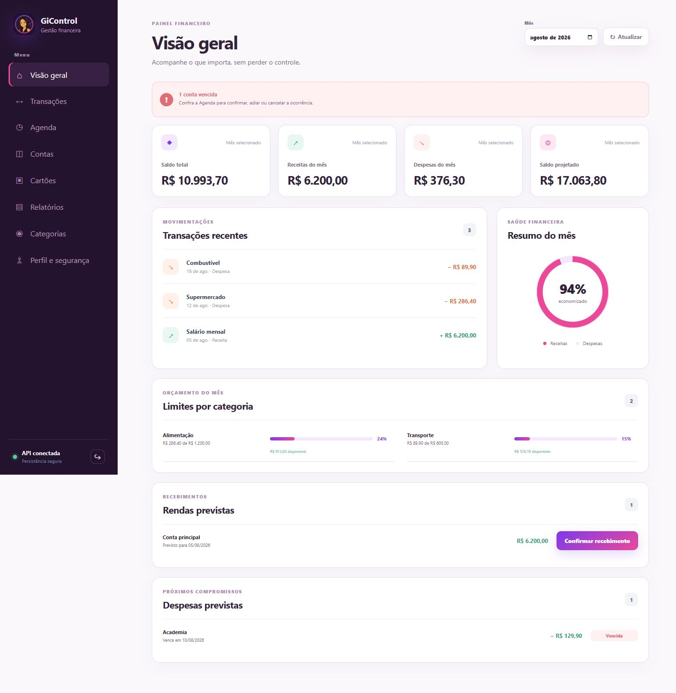
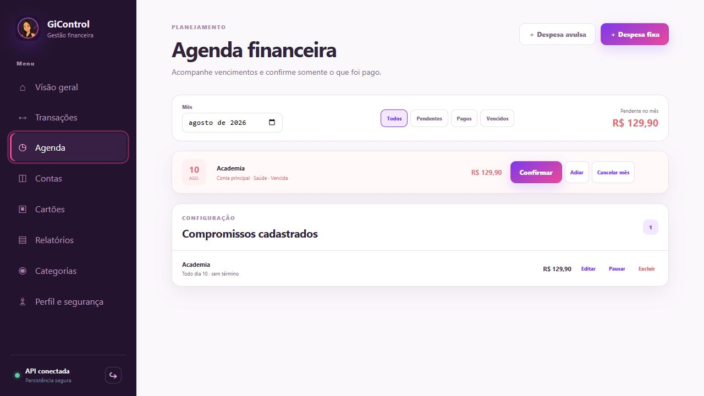
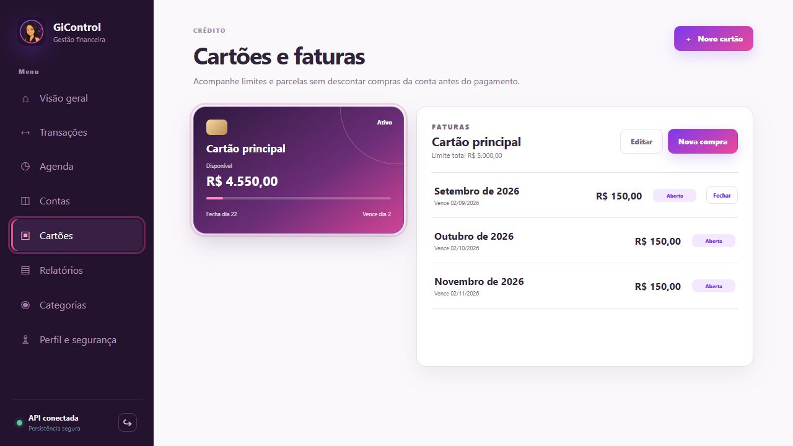

<div align="center">
  

  # GiControl

  **Simple, visual, and centralized personal finance management.**

  A single workspace for balances, income, expenses, credit cards, financial commitments, and monthly goals.
</div>

---

## Overview

GiControl is a personal finance application designed to organize your financial routine in one place. It brings together accounts, transactions, categories, recurring expenses, credit cards, monthly planning, and reports in a responsive interface for desktop and mobile devices.

The web application combines a React frontend with a FastAPI backend. Data can be stored locally with SQLite or remotely in PostgreSQL through Supabase. A legacy PySide6 desktop interface remains available for local use and compatibility.

## Core capabilities

- **Financial dashboard** — consolidated view of current balance, income, expenses, monthly savings, upcoming commitments, and recent transactions.
- **Accounts and wallets** — create accounts, adjust balances, and configure expected monthly income.
- **Transactions** — record income and expenses, edit or safely delete entries, split purchases into installments, and connect transactions to accounts and categories.
- **Financial agenda** — track recurring and one-time expenses, filter them by status, confirm payments, postpone due dates, or skip individual occurrences.
- **Credit cards** — manage limits, closing and due dates, installment purchases, invoices, and payments.
- **Categories and budgets** — organize income and expenses and define monthly spending limits by category.
- **Monthly reports** — review income, expenses, and monthly results, with CSV export support.
- **Authentication** — sign in with Google or receive a magic link by email through Supabase Auth.
- **Responsive interface** — navigation optimized for desktop, tablet, and mobile screens.

## Screenshots

The examples below use fictional demonstration data and do not expose user financial information.

### Dashboard



### Financial agenda



### Credit cards



## Technology stack

| Area | Technologies |
| --- | --- |
| Web frontend | React 19, TypeScript, Vite |
| API | Python, FastAPI, Uvicorn |
| Local persistence | SQLite |
| Cloud persistence | Supabase, PostgreSQL |
| Authentication | Supabase Auth |
| Desktop application | PySide6 (Qt for Python) |
| Testing | Pytest, Vitest |
| Deployment | Docker, Render |

## Architecture

```text
Fincontrol/
├── frontend/                    React web interface
│   ├── public/                  Icons, logo, and PWA manifest
│   └── src/
│       ├── api/                 API client and contracts
│       ├── auth/                Supabase Auth integration
│       └── pages/               Application screens
├── backend/
│   ├── domain/                  Financial entities and business rules
│   ├── application/
│   │   ├── ports/               Persistence contracts
│   │   └── services/            Application use cases
│   ├── infrastructure/          SQLite, PostgreSQL, and migrations
│   └── presentation/            FastAPI API and production server
├── views/                       Legacy PySide6 desktop interface
├── tests/                       Automated backend tests
├── Dockerfile                   Integrated production build
└── render.yaml                  Render deployment configuration
```

The frontend communicates with the backend through `/api`. Domain rules and application services remain independent from the persistence layer, allowing the application to switch between SQLite and PostgreSQL without changing its core behavior. In production, FastAPI also serves the compiled frontend from the same domain.

## Installation and setup

### Requirements

- Python 3.10 or newer
- Node.js 22 or newer
- npm

### 1. Clone the repository

```bash
git clone https://github.com/arthur-afonso-GIT/Fincontrol.git
cd Fincontrol
```

### 2. Set up the backend

Create a virtual environment:

```bash
python -m venv .venv
```

On Windows, activate it and install the dependencies:

```powershell
.venv\Scripts\Activate.ps1
pip install -r requirements.txt
uvicorn api_main:api --reload
```

Without additional configuration, the backend stores data locally in `data/fincontrol.db` using SQLite.

### 3. Set up the frontend

In a separate terminal:

```bash
cd frontend
npm install
npm run dev
```

Copy `.env.example` to `.env` and provide `SUPABASE_URL`, `SUPABASE_ANON_KEY`, `VITE_SUPABASE_URL`, and `VITE_SUPABASE_ANON_KEY` to enable authentication. During development, add the local URL shown by Vite to the allowed redirect URLs in Supabase.

### Desktop application

After installing the Python dependencies, run:

```bash
python main.py
```

## Supabase persistence

To use PostgreSQL, configure `DATABASE_URL` with the Supabase Session Pooler connection string and keep `sslmode=require`. Never commit credentials to Git; use `.env.example` only as a configuration template.

Preview the local data migration before making any changes:

```bash
python -m backend.infrastructure.migrate_to_postgres --source sqlite
```

After reviewing the record counts, run the migration:

```bash
python -m backend.infrastructure.migrate_to_postgres --source sqlite --execute
```

The migration refuses to write to a destination that already contains data. Use `--overwrite` only after creating a backup and confirming that the existing destination data can be replaced.

## Deployment

The repository includes a Docker build that compiles the frontend and packages the application as a single service. FastAPI serves the API under `/api` and delivers the SPA from the same domain.

To deploy on Render, connect this repository as a **Blueprint**, configure the variables listed in `.env.example`, and wait for the `/api/health` endpoint to become available. See [DEPLOYMENT.md](DEPLOYMENT.md) for the complete instructions.

## Data and security

- Frontend authentication uses Supabase Auth without exposing the service-role key in the browser.
- The API validates access tokens when `AUTH_REQUIRED=true`.
- Credentials and connection strings must remain in environment variables.
- Monetary values are handled by the domain layer to avoid inaccurate financial calculations.
- PostgreSQL migration provides a preview mode and protection against accidental overwrites.

GiControl provides technical tools for personal financial organization. Backup routines, access policies, and credential protection should be established before using the application in production.

## Authors

- [Arthur Florencio Afonso de Albuquerque](https://www.linkedin.com/in/arthur-flor%C3%AAncio-afonso/)
- [Giovana Bruna Almeida Rocha](https://www.linkedin.com/in/giovana-bruna-8bbb443bb/)
